<h1>Namaste!</h1>

I'm Rushikesh from  <b>Pune, India</b>(based out of Bengaluru). 

  

  <a href="https://github.com/rushikeshpandit">
  
  

  

  
:zap: Github Stats

  

  
:zap: Languages Used

  

  

      
<h4>Proficient in</h4>

  
  
  
  
  
  

<h4>Exposd to</h4>

  
  
  
  
  

<h4>Currently learning</h4>

  
  

<h3>Where to find me</h3>

   

<!--
**rushikeshpandit/rushikeshpandit** is a ✨ _special_ ✨ repository because its `README.md` (this file) appears on your GitHub profile.

Here are some ideas to get you started:

- 🔭 I’m currently working on ...
- 🌱 I’m currently learning ...
- 👯 I’m looking to collaborate on ...
- 🤔 I’m looking for help with ...
- 💬 Ask me about ...
- 📫 How to reach me: ...
- 😄 Pronouns: ...
- ⚡ Fun fact: ...
-->
